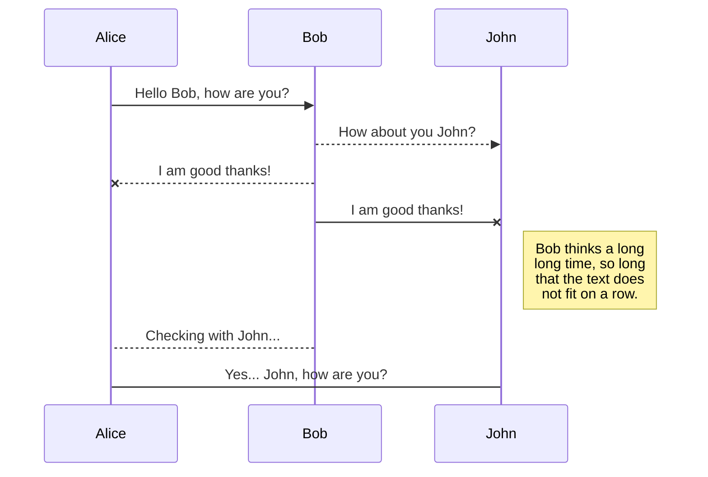
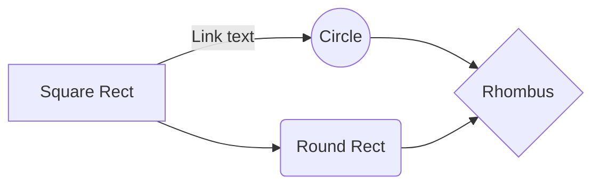

# Welcome to our BlockWord Repository!

This project is sponsored by blockchain901.org.

## BlockWord Game Project
We are developing a word guessing game similar to the legacy game "Hangman". This game interacts across the web full stack. Our game incorporates several web systems including - drizzle, node.js, ethereum virtual machine, and react.js. 

## TruffleSuite

We are using the TruffleSuit IDE. It is a open source blockchain development tool found at trufflesuites.com.

## Drizzle

The file explorer is accessible using the button in left corner of the navigation bar. You can create a new file by clicking the **New file** button in the file explorer. You can also create folders by clicking the **New folder** button.

## React

All your files and folders are presented as a tree in the file explorer. You can switch from one to another by clicking a file in the tree.

## BlockWord Contract

You can rename the current file by clicking the file name in the navigation bar or by clicking the **Rename** button in the file explorer.

## Blockword

You can delete the current file by clicking the **Remove** button in the file explorer. The file will be moved into the **Trash** folder and automatically deleted after 7 days of inactivity.

# StackEdit.io Markdown extensions

StackEdit extends the standard Markdown syntax by adding extra **Markdown extensions**, providing you with some nice features.  You can disable any **Markdown extension** in the **File properties** dialog.

### This section is saved for future use. The UML Diagrams look fantastic. I hope we can make diagrams that show the state machine of our game.

## UML diagrams

You can render UML diagrams using [Mermaid](https://mermaidjs.github.io/). For example, this will produce a sequence diagram:

And this will produce a flow chart:

<!--stackedit_data:
eyJoaXN0b3J5IjpbMTE1Mzc1MjMwN119
-->